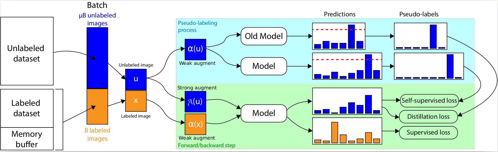

# PLCiL
Implementation of the Pseudo-Labeling for Class incremental Learning




# Work In Progress
Documentation will be completed by the start of the conference: November 22, 2021.

# Requirements

* Python >= 3.7
* PyTorch >= 1.9
* Hydra >= 1.1 

# Datasets


# Training


# Citation

```bibtex
 @INPROCEEDINGS{lechat2021PLCiL,
  author={Alexis Lechat and Stéphane Herbin and Frédéric Jurie},
  title={Pseudo-Labeling for Class Incremental Learning},
  booktitle={Proceedings of the British Machine Vision Conference, {BMVC}, 2021}, 
  year={2021}}
```

# Acknowledgement

This code uses the following implementations :


* CTAugment implementation from [[github]](https://github.com/google-research/fixmatch) 
* Datasets sampler from [[github]](https://github.com/CoinCheung/fixmatch-pytorch)
* Wide-ResNet implementation from [[github]](https://github.com/meliketoy/wide-resnet.pytorch) modified to fit the WRN28-8 proposed by [[Sohn et al. 2020]](https://arxiv.org/abs/2001.07685)

